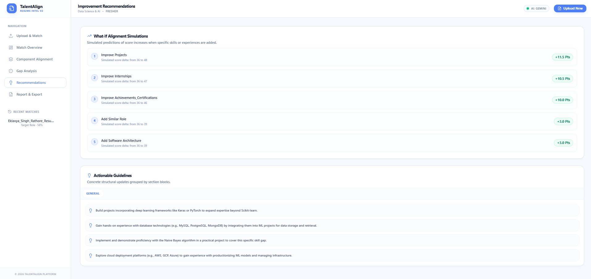

# TalentAlign

> AI-powered career-intelligence platform that analyzes a candidate resume
> against a job description and produces an explainable, multi-component
> fit assessment.

[](https://talent-align.vercel.app)
[](LICENSE)

[](Main/backend/requirements.txt)
[](https://fastapi.tiangolo.com)
[](Main/frontend/package.json)
[](Main/frontend/tsconfig.json)
[](Main/frontend/tailwind.config.js)
[](https://ai.google.dev)
[](https://vercel.com)
[](https://render.com)

</div>

Two services:

- **Backend** — FastAPI + Uvicorn + SBERT + (optional) Gemini 2.5 Flash
- **Frontend** — Next.js 14 (App Router) + Tailwind + Recharts dashboard

## Overview

**TalentAlign** is a production-deployed AI-powered platform that analyzes a candidate's resume against a job description and produces a structured, explainable fit assessment. It combines deterministic semantic matching, a multi-component scoring framework, and Gemini-generated narrative analysis to deliver hiring-grade insight that ATS-style keyword filters and pure-LLM tools cannot.

The system is **live in production** with end-to-end Gemini integration, deterministic scoring, and graceful degradation. Every analysis produces a 29-key payload powering six dashboard views: Upload & Match, Match Overview, Component Alignment, Gap Analysis, Recommendations, and Report & Export.

---

## Quick architecture

```
[Browser]
   │  HTTPS POST /analyze (multipart resume + JD text)
   ▼
[Frontend — Next.js dashboard]   ← Vercel
   │  fetch ${NEXT_PUBLIC_API_BASE_URL}/analyze
   ▼
[Backend — FastAPI]              ← Render / Fly.io / Cloud Run
   │
   ├─→ Resume parser → JD intelligence → Experience intel → Project intel
   ├─→ 6-layer skill matcher  (SBERT embeddings, all-MiniLM-L6-v2)
   ├─→ MW-ESE 6-component scoring  (9 domain weight profiles)
   └─→ (optional) Gemini enrichment + validation gate
           └─→ Candidate Assessment narrative, Strengths, Gaps, Hiring rec
```

**29-key analysis payload** delivered to the dashboard. Six screens:
Upload & Match · Match Overview · Component Alignment · Gap Analysis ·
Recommendations · Report & Export.

---

## Screenshots

Below is a walkthrough of the **TalentAlign** interface across its six primary screens:

### 1. Upload & Match
Initial entry screen featuring a branded hero, a resume file dropzone (PDF/DOCX), and a job description text input.


---

### 2. Match Overview
Primary dashboard displaying the overall match score, component analytics chart, metadata cards, and the AI-generated Candidate Assessment.


---

### 3. Component Alignment
Detailed view of the six scoring components showing weights and actual contribution alongside adaptive weight redistribution rules.


---

### 4. Gap Analysis
Visualizes the total recoverable score, missing skills with impact ratings, and structural resume section gaps.


---

### 5. Recommendations
Includes what-if simulations showing predicted score uplift alongside categorized actionable guidelines for candidates.



---

### 6. Report & Export
Full printable report containing the executive summary, component breakdown, skill coverage metrics, core strengths, and recommendations.


---

## Installation

### Prerequisites

- Python 3.11 (`python --version`)
- Node.js 18+ (`node --version`)
- A Google Gemini API key from [Google AI Studio](https://ai.google.dev) (optional — system runs in deterministic-only mode without it)

### Backend setup

```bash
git clone https://github.com/Eklavya-Singh-Rathore/TalentAlign.git
cd TalentAlign/Main/backend

# Install Python dependencies
pip install -r requirements.txt
python -m spacy download en_core_web_sm

# Configure environment
cp .env.example .env
# Edit .env and set GEMINI_API_KEY (optional)

# Start the API server
uvicorn app.main:app --reload --port 8000
```

Health check: [http://localhost:8000/health](http://localhost:8000/health) → `{"status": "ok", ...}`
OpenAPI docs: [http://localhost:8000/docs](http://localhost:8000/docs)

### Frontend setup

```bash
cd ../frontend

# Install dependencies
npm install

# Configure environment
cp .env.example .env.local
# .env.local should contain:
#   NEXT_PUBLIC_API_BASE_URL=http://localhost:8000

# Start the dev server
npm run dev
```

Open [http://localhost:3000](http://localhost:3000).

### Run tests

```bash
cd Main/backend
LLM_BACKEND=none TALENTALIGN_EMBEDDING_BACKEND=tfidf pytest tests/ -q
# Expected: 551 passed, 7 deselected
```

### Build production frontend

```bash
cd Main/frontend
npm run build
npm start    # serves the production build on port 3000
```

---

## Repository layout

```text
TalentAlign/
├── LICENSE                          MIT
├── README.md                        ← this file
├── DEPLOYMENT.md                    Production deployment runbook
│
└── Main/
    ├── backend/                     FastAPI service (Render)
    │   ├── Dockerfile               Production container image
    │   ├── requirements.txt
    │   ├── pytest.ini · conftest.py
    │   ├── .env.example             13 documented env vars
    │   ├── README.md · BACKEND_AUDIT.md
    │   ├── app/                     36 source files
    │   │   ├── main.py              FastAPI app + /health + /analyze
    │   │   ├── core/                config.py · weight_config.json
    │   │   ├── services/            11 service modules
    │   │   │   ├── analysis.py      Orchestrator → 29-key payload
    │   │   │   ├── experience_intelligence.py
    │   │   │   ├── explainability.py
    │   │   │   ├── improvement_engine.py
    │   │   │   ├── jd_intelligence.py
    │   │   │   ├── jd_parser/       4-file package
    │   │   │   ├── project_intelligence.py
    │   │   │   ├── recommendation_engine.py
    │   │   │   ├── resume_parser.py
    │   │   │   ├── scoring_engine.py
    │   │   │   └── skill_matcher.py
    │   │   └── utils/               9 utility modules
    │   │       ├── duration_extraction.py
    │   │       ├── embeddings.py    TF-IDF + SBERT cascade
    │   │       ├── file_handling.py
    │   │       ├── jd_noise_filter.py
    │   │       ├── llm.py           Gemini provider + cache
    │   │       ├── llm_schemas.py   Pydantic schemas
    │   │       ├── project_extraction.py
    │   │       ├── skill_normalization/   5-file package
    │   │       └── text_cleaning.py
    │   ├── scripts/                 prewarm_sbert.py · smoke_test.sh
    │   └── tests/                   551 tests + fixtures + eval harness
    │       ├── fixtures/            6 resumes · 9 JDs · Python fixtures
    │       ├── eval/                54-pair eval harness + gold labels
    │       ├── llm/                 Mock + live LLM tests
    │       ├── utils/               MockLLMProvider
    │       └── reports/             Eval matrix results
    │
    └── frontend/                    Next.js dashboard (Vercel)
        ├── package.json · package-lock.json
        ├── next.config.js · tsconfig.json
        ├── tailwind.config.js · postcss.config.js
        ├── vercel.json
        ├── .env.example
        ├── README.md
        └── src/                     41 source files
            ├── app/                 Routes: / · /analysis · /reports · /settings
            ├── components/
            │   ├── layout/          shell · sidebar · header
            │   ├── upload/          dropzone · jd input · validation banner
            │   ├── dashboard/       gauge · KPI cards · breakdown · gaps · recs · export · candidate-summary
            │   ├── charts/          bar · radar · radial · skill-match
            │   ├── tables/          skill-table · analysis-history-table
            │   └── ui/              button · card · badge · empty-state · tabs
            ├── hooks/               useUpload · useAnalysis · useResponsive
            ├── lib/                 api · types · formatters · validators · constants
            └── stores/              AnalysisProvider (Context + localStorage)

---

## License

[MIT](LICENSE) © 2026 Eklavya Singh Rathore

---

## Acknowledgments

- Embeddings: `sentence-transformers/all-MiniLM-L6-v2`
- LLM: Google Gemini 2.5 Flash
- PDF/DOCX: PyMuPDF, python-docx
- NLP: spaCy
- Frontend: Next.js, Tailwind, Recharts, Framer Motion, Lucide
